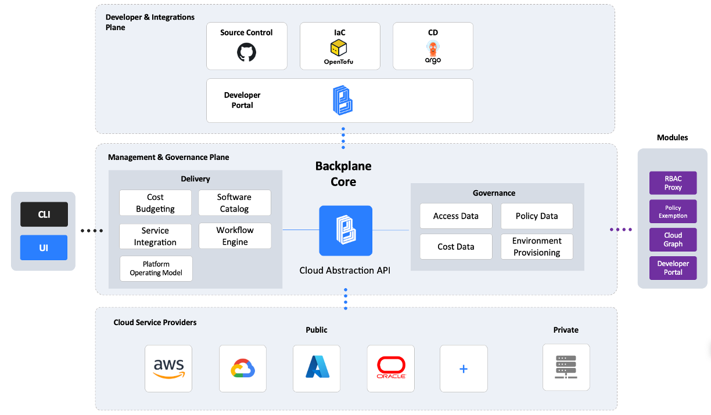

# Introduction

Let's discover **Backplane in less than 5 minutes**.

## What is Backplane ?

Backplane is a set of tools to simplify multi-cloud governance at enterprise-scale and to simplify and speed up custom integrations.

It provides cost, access and policy data retrieval and allows for cross-cloud environment provisioning.

Backplane comes in two flavours depending on your requirements:

### Cloud Abstraction API Server (Backplane Core)

- The Cloud Abstraction API helps organisations govern multiple clouds, bring cost, access and resource control visibility across cloud platforms into a single view through the Backplane Software Catalog.

- It is designed for platform engineers, enterprise architects and developers for cloud adoption, enablement and governance.

- It helps to both simplify and speed up internal developer portal development with abstracted environment creation.

  - Software Catalog
  - Cost Budgeting
  - Workflow Engine
  - Full built-in RBAC
  - Service Integration
  - CLI

### Backplane Library

- A set of abstracted functions for retriving cloud cost, access, policies and creating environments in AWS, Azure and GCP.

- Saving Developers integration time and effort so they can reason about cloud platforms in an abstracted manner. For example, rather than creating an Account in AWS or a Subscription in Azure or a Project in GCP, you simply provision 'Cloud Space'. In Backplane, the App represents the 'Cloud Space' that ultimately comprise the environments.

<!-- ## Why use Backplane ?

Multi-cloud governance complex and integrating into cloud platforms requires significant effort and expertise.

Through Backplane's abstracted wrapper, whether the Backplane Library or the Backplane API Server, interfacing with the Cloud Platforms for governance purposes is made simple.

## What benefits does Backplane provide ?

### Inefficient use of developers time

- When building an internal developer platform, code needs to be written to integrate to each of the Cloud vendors APIs for the concerns of environment provisioning, cost, access and policy data retrieval.

- Developers can use the Backplane Module Library to rapidly integrate multi-cloud environment provisioning into their development platform.

- In addition, the Backplane Cloud Abstraction API provides a RESTful service to use.

- Irregular data shape

  The Access, Cost and Policy datashape is different depending on whether you're pulling this data from Azure, GCP or AWS. The Abstraction API essential does an in-flight ETL to present the data in a standardised 'abstracted' view. This makes reasoning about data across the cloud landscape much simpler.

- DevOps vs. Platform Engineering

  Backplane is unopinionated in this regard, it essentially operates a bring-your-own-process, and recognises that approval workflows are necessary, particularly when approving budgets. Backplane has you covered with its inbuilt workflow approval engine.

### Solution

- Backplane simplifies the Cloud landscape by providing a single abstraction API for the purposes of environment provisioning and extraction of governance data, from cost, access and policies. With a more generalised, abstracted form of the data, building IDPs and CMPs becomes a more trivial activity.

- So whether you're building a custom internal development platform or cloud management platform, or have a need to consume cloud governance data as a service, the Backplane API can help.

- The below diagram illustrates how Backplane sits in-between the Cloud Service Providers and the Developer planes, to provide a governance plane and single integration point.

## Core Features

### Environment Provisioning :cloud:

Whether you're creating Resource Groups in Azure, or Folders in GCP or Accounts in AWS, what you care about is some cloud 'space'. Provisioning Cloud Space (aka Environments) is abstracted away, so the only decision you need to decide upon is which underlying Cloud Platform you wish to host your Cloud workload.

### Software Catalog :earth_americas:

In addition, having a single-source-of-truth in the software catalog, allows enterprise architectecture to map capabilities and catalog workloads. As well as being a reference for managing cloud-native transformation activities.

### FinOps :moneybag:

Having cost visibility at a Product and Platform and Org level is crucial to tracking budgeted spend. All Apps which consume cost can only be linked to a parent Product that has a budget approved. This accountability at the workload level ensures there are no cost overruns are Product value can be more easily articulated at a Platform and Product level.

### Access :lock:

Understanding **Who has access to what** is key to ensuring a good access posture across multiple cloud platforms.

### Policy :shield:

Guardrails are put in place to ensure that resources adhere to security and architectural references. Having these enforced consistently across cloud platforms and having visibility of these is critical to operating cloud platforms at scale. -->

Are you ready to [Get Started](/docs/quick-start) ?
